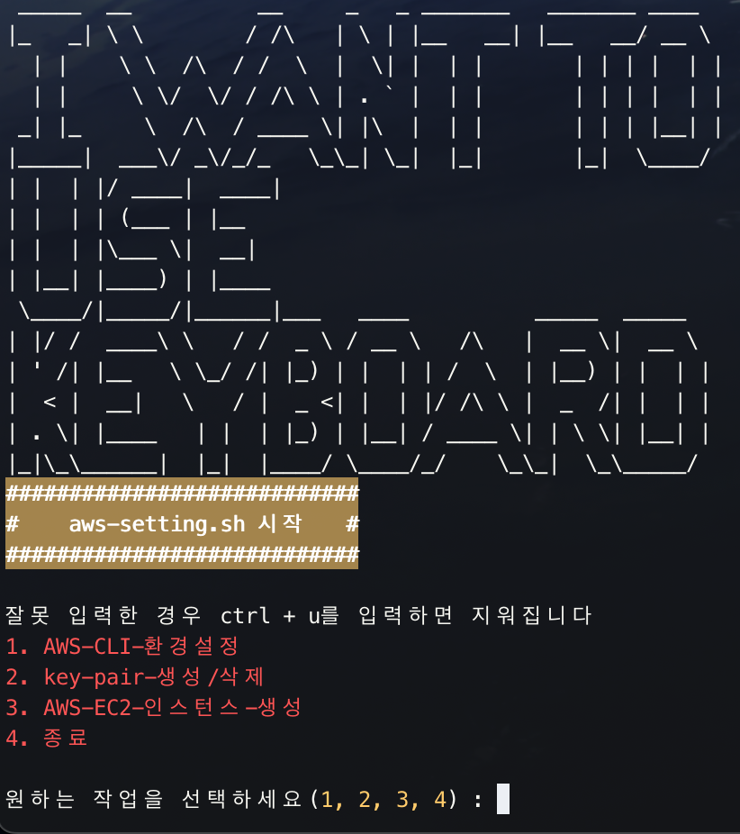

# aws-cli-ec2-script

# 1. 프로젝트 설명

- `Shell Script`를 통해서 `AWS-CLI` 명령어를 활용하여 AWS EC2 인스턴스를 실행

# 2. 사전 조건

- 필요한 IAM은 생성되어 해당 IAM의 `access_key`와 `access_secret_key`를 이미 가지고 있음
- `VPC`와 `Subnet`은 사전에 구성되어 있음
- `MAC OS`

# 3. 사용 방법

```bash
#aws-setting.sh 스크립트 실행
./aws-setting.sh
```



# 4. 기능

- AWS-CLI 설치 및 초기 환경 설정
- key pair 생성 삭제
- AWS EC2 인스턴스 생성
  - AMI 이미지
  - 인스턴스 수
  - 인스턴스 타입
  - 서브넷
  - 보안 그룹
  - 키페어
  - 퍼블릭 IP 설정
- 종료
- 뒤로가기
